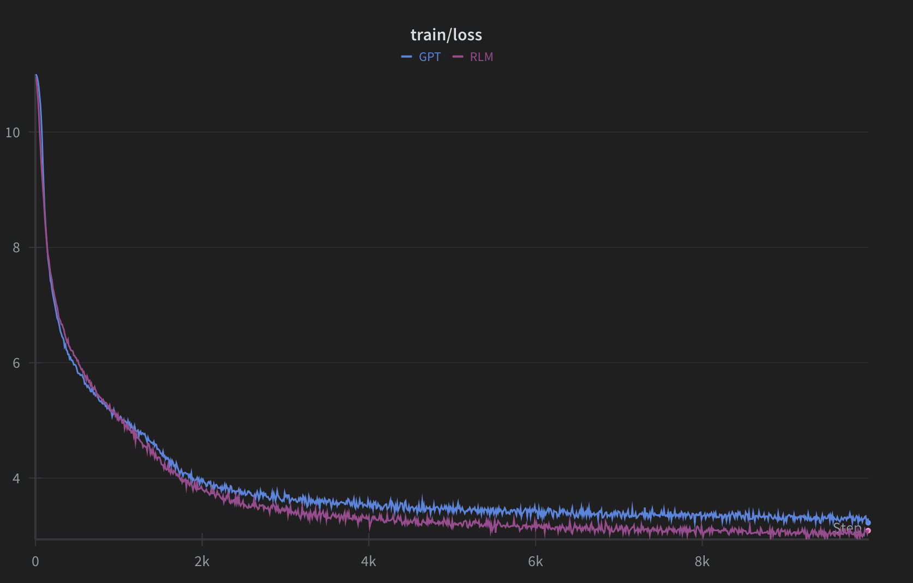
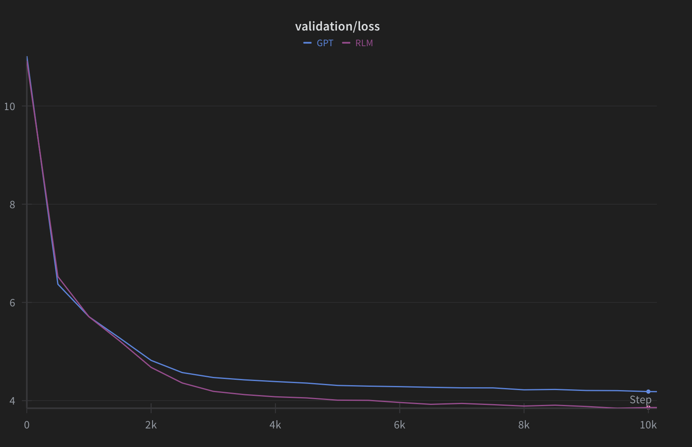

# Tiny Recursive Language Model (TRLM) Experiment

Экспериментальный проект по исследованию эффективности рекурсивных трансформеров. Сравнение рекурсивной архитектуры и стандартной GPT.

**Текущий результат:** Рекурсивная модель (TRLM) достигает более низкого loss по сравнению с GPT при **том же количестве обучаемых параметров**. 


<p align="center">
  
   
</p>

## Особенности
*   **Архитектура:** Реализация кастомного `TRLM` и стандартного `GPT` на PyTorch
*   **Конфигурация:** Гибкое управление через **Hydra**
*   **Логирование:** Интеграция с **WandB**
*   **Данные:** Поддержка WikiText и MiniPile

## Запуск

1. **Установка зависимостей:**
   ```bash
   pip install -r requirements.txt
   ```

2. **Подготовка данных:**
   ```bash
   python prepare_dataset.py data=wikitext
   ```

3. **Обучение:**
   ```bash
   # Обучение TRLM
   python train.py model=trlm data=wikitext

   # Обучение GPT
   python train.py model=gpt data=wikitext
   ```

## Структура
*   `conf/` - Конфигурации (модель, оптимизатор, данные)
*   `model/` - Реализация `GPT`, `TRLM` и `LossHead`
*   `train.py` - Цикл обучения с поддержкой gradient accumulation и смешанной точности